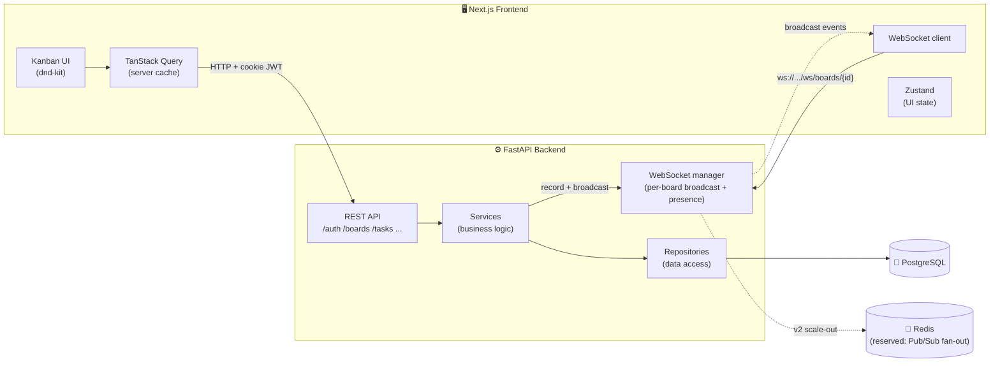

<div align="center">

# 🗂️ TaskFlow

### A modern, real-time collaborative kanban task manager

Build boards, drag tasks across columns, and collaborate live — changes appear instantly for everyone on the board.


[Live demo](#) · [Report a bug](#) · [Request a feature](#)

</div>

> _**Live demo:** `https://taskflow-demo.example.com` (placeholder — drop your deployed URL here)_

<!-- Add a hero GIF/screenshot here, e.g. docs/hero.gif -->
<!--  -->

---

## ✨ Features

| | Feature | Notes |
|---|---|---|
| 🔐 | **Authentication** | Email + password, JWT in an **httpOnly cookie** (not localStorage), protected routes, password-reset endpoint |
| 🗂️ | **Boards** | Unlimited boards with name, description, color theme, last-activity timestamp |
| 📋 | **Kanban columns** | Default *To Do / In Progress / Done*; add, rename, delete, and reorder custom columns |
| 🃏 | **Tasks** | Title, markdown description, due date, priority (Low/Med/High), color labels; edit in a drawer-style modal |
| 🖱️ | **Drag & drop** | Powered by **dnd-kit** — reorder within a column and move across columns with **optimistic UI** |
| ⚡ | **Real-time** | WebSocket per board — another user's move appears instantly, no refresh |
| 👥 | **Presence** | Live avatars of everyone currently viewing the board |
| 📝 | **Activity feed** | "Zain moved 'Onboarding' to Done" — last 20 events, updated live |
| 👤 | **Roles & sharing** | Owner / Editor / Viewer model; owners invite members by email, change roles, and remove members from a Board Settings panel — owner protected, enforced server-side |
| ⌨️ | **Keyboard shortcuts** | `n` new task · `/` focus search · `Esc` close modals |
| 🌐 | **Bilingual + RTL/LTR** | Full Arabic/English UI with a language switcher on every screen; direction flips live, preference persists, dynamic content (dates, activity feed) localized |
| 🌙 | **Dark UI** | Tokyo Night aesthetic, mobile-responsive, smooth animations, friendly empty states |

---

## 🧱 Tech stack

**Frontend** — Next.js 14 (App Router) · TypeScript (strict) · Tailwind CSS (logical properties for RTL) · TanStack Query (server state) · Zustand (UI state) · React Hook Form + Zod · dnd-kit · lucide-react · sonner · lightweight custom i18n (Arabic/English, no extra deps)

**Backend** — FastAPI · SQLAlchemy 2.0 (async) · Alembic · Pydantic v2 · PostgreSQL · native WebSockets · python-jose (JWT) · bcrypt · slowapi (rate limiting) · pytest

**DevOps** — Docker + docker-compose · separate Dockerfiles · `.env` config

---

## 🏛️ Architecture



**How real-time works:** all authoritative state changes go through the REST API. After a mutation, the service records an activity entry and the WebSocket manager **broadcasts** the resulting event to every socket on that board. The originating client already applied the change optimistically, so it ignores its own echo; other clients apply it live. The kanban board reflows under the cursor during a drag via dnd-kit's `onDragOver`, and the final position is persisted on drop.

See **[docs/ARCHITECTURE.md](docs/ARCHITECTURE.md)** for the layered design, data model, and the in-memory → Redis scaling path.

### Request flow (clean layering)

```
Route (HTTP/validation)  →  Service (business logic)  →  Repository (data access)  →  DB
                                     │
                                     └─→ realtime.record_and_broadcast() → WebSocket manager
```

---

## 📁 Folder structure

```
taskflow/
├── backend/
│   ├── app/
│   │   ├── api/           # routes + dependencies (auth, permission guards)
│   │   ├── core/          # config, security, errors, rate limiting
│   │   ├── db/            # async engine, session, declarative base
│   │   ├── models/        # SQLAlchemy models
│   │   ├── schemas/       # Pydantic v2 schemas
│   │   ├── repositories/  # data-access layer
│   │   ├── services/      # business logic + realtime helper
│   │   ├── websockets/    # connection manager + presence
│   │   └── main.py        # app factory
│   ├── alembic/           # migrations
│   ├── tests/             # pytest (isolated in-memory DB)
│   └── requirements*.txt
├── frontend/
│   └── src/
│       ├── app/           # App Router: (auth) and (app) route groups
│       ├── components/    # ui primitives, kanban, boards
│       ├── hooks/         # use-auth, use-board, use-board-socket, shortcuts
│       ├── lib/           # api client, endpoints, types, board logic
│       └── stores/        # Zustand UI store
├── docker-compose.yml
├── Makefile
└── docs/
```

---

## 🚀 Getting started

### Prerequisites

- **Docker** + Docker Compose (for the one-command setup)
- **Node 20+** and **Python 3.11+** (for local dev without Docker)

### Option A — Docker (everything at once)

```bash
git clone <your-repo-url> taskflow && cd taskflow

# Set a strong secret (optional for local; required for anything public)
export SECRET_KEY="$(python -c 'import secrets; print(secrets.token_urlsafe(48))')"

docker compose up --build
```

- Frontend → http://localhost:3000
- Backend API + docs → http://localhost:8000/docs
- The `api` service runs Alembic migrations automatically before starting.

### Option B — Local development (no Docker)

The backend defaults to **SQLite** locally, so you don't need Postgres to try it.

**Backend**

```bash
cd backend
python -m venv .venv
# Windows:  .venv\Scripts\activate
# macOS/Linux:  source .venv/bin/activate
pip install -r requirements-dev.txt

cp .env.example .env            # adjust if you like
uvicorn app.main:app --reload   # tables auto-create on first run (SQLite)
```

API runs at http://localhost:8000 — interactive docs at `/docs`.

**Frontend** (in a second terminal)

```bash
cd frontend
npm install
cp .env.example .env.local
npm run dev
```

App runs at http://localhost:3000.

### Running migrations

Local dev with SQLite auto-creates tables on startup. For Postgres / production, use Alembic:

```bash
cd backend
alembic upgrade head                          # apply migrations
alembic revision --autogenerate -m "message"  # create a new migration
# or, from the repo root:
make migrate
make migration m="add due-date index"
```

### Running tests

```bash
# Backend — 30 tests, isolated in-memory DB, coverage report
cd backend && pytest --cov=app --cov-report=term-missing

# Frontend — Vitest (hooks/utils + drag-drop ordering logic)
cd frontend && npm run test

# Or everything via Make:
make test
```

---

## 🔌 API overview

FastAPI serves auto-generated, interactive docs:

- **Swagger UI** → http://localhost:8000/docs
- **ReDoc** → http://localhost:8000/redoc
- **OpenAPI JSON** → http://localhost:8000/openapi.json

| Group | Endpoints |
|---|---|
| **Auth** | `POST /api/auth/signup` · `POST /api/auth/login` · `POST /api/auth/logout` · `GET /api/auth/me` · `POST /api/auth/password-reset/request` · `POST /api/auth/password-reset/confirm` |
| **Boards** | `GET/POST /api/boards` · `GET/PATCH/DELETE /api/boards/{id}` · `POST /api/boards/{id}/members` |
| **Columns** | `GET/POST /api/boards/{id}/columns` · `PATCH/DELETE /api/boards/{id}/columns/{cid}` · `POST /api/boards/{id}/columns/reorder` |
| **Tasks** | `GET /api/boards/{id}/tasks` (snapshot) · `POST .../tasks?column_id=` · `GET/PATCH/DELETE .../tasks/{tid}` · `POST .../tasks/{tid}/move` |
| **Labels** | `GET/POST /api/boards/{id}/labels` · `DELETE .../labels/{lid}` |
| **Activity** | `GET /api/boards/{id}/activity` |
| **WebSocket** | `WS /ws/boards/{board_id}` |

**Consistent errors** — every error returns `{ "error": string, "code": string, "details"?: object }`.
**Rate limiting** — auth endpoints are throttled per IP (`AUTH_RATE_LIMIT`, default `10/minute`).

---

## ⚙️ Environment variables

**Backend** (`backend/.env` — see `.env.example`)

| Variable | Default | Purpose |
|---|---|---|
| `DATABASE_URL` | `sqlite+aiosqlite:///./taskflow.db` | DB connection (use `postgresql+asyncpg://…` in prod) |
| `SECRET_KEY` | _change me_ | JWT signing secret |
| `ACCESS_TOKEN_EXPIRE_MINUTES` | `1440` | Access token lifetime |
| `COOKIE_SECURE` | `false` | Set `true` behind HTTPS |
| `COOKIE_SAMESITE` | `lax` | `lax` / `strict` / `none` |
| `BACKEND_CORS_ORIGINS` | `http://localhost:3000` | Comma-separated frontend origins |
| `AUTH_RATE_LIMIT` | `10/minute` | slowapi limit for auth routes |
| `REDIS_URL` | _unset_ | Reserved for v2 WebSocket Pub/Sub |

**Frontend** (`frontend/.env.local` — see `.env.example`)

| Variable | Default | Purpose |
|---|---|---|
| `NEXT_PUBLIC_API_URL` | `http://localhost:8000` | Backend base URL |
| `NEXT_PUBLIC_WS_URL` | `ws://localhost:8000` | WebSocket base URL |

---

## 🚢 Deployment

### Frontend → Vercel

1. Import the repo into Vercel; set **Root Directory** to `frontend/`.
2. Add env vars `NEXT_PUBLIC_API_URL` and `NEXT_PUBLIC_WS_URL` pointing at your deployed backend (use `https://` / `wss://`).
3. Deploy. (The Next.js build uses `output: "standalone"`, which also makes the Docker image small.)

### Backend → Render / Railway

1. Create a **PostgreSQL** instance; copy its connection string and convert the scheme to `postgresql+asyncpg://…`.
2. Create a **Web Service** from `backend/` (Docker). Set env vars: `DATABASE_URL`, `SECRET_KEY`, `BACKEND_CORS_ORIGINS=https://<your-vercel-app>`, `COOKIE_SECURE=true`, `COOKIE_SAMESITE=none` (required for cross-site cookies between Vercel and the API).
3. The container runs `alembic upgrade head` on boot, then starts uvicorn.
4. (Optional) Add a Redis instance and set `REDIS_URL` to prepare for multi-instance WebSocket scaling.

> **Cross-site cookie note:** because the JWT lives in an httpOnly cookie, the frontend and backend must agree on cookie policy. For different domains, use `COOKIE_SECURE=true` + `COOKIE_SAMESITE=none` and serve both over HTTPS.

---

## 🗺️ Roadmap

- [ ] Real transactional email for password reset (provider TODO is wired in `auth_service.py`)
- [ ] Redis Pub/Sub for multi-instance WebSocket fan-out (in-memory in v1 — see manager TODO)
- [ ] Task comments & attachments
- [ ] Board templates and task search across boards
- [ ] Due-date reminders / notifications
- [ ] Audit-grade activity log with filtering
- [ ] E2E tests (Playwright) and frontend component test coverage

---

## 🧰 Developer commands

```bash
make help          # list all targets
make install       # install backend + frontend deps
make dev-backend   # run FastAPI (reload)
make dev-frontend  # run Next.js (reload)
make test          # run all tests
make lint          # ruff + eslint
make format        # ruff format + prettier
make up / make down  # docker compose lifecycle
```

Pre-commit hooks: backend via [`pre-commit`](.pre-commit-config.yaml) (`pre-commit install`), frontend via husky + lint-staged (`npm run prepare` in `frontend/`).

---

## 📄 License

[MIT](LICENSE) © Zain M.
