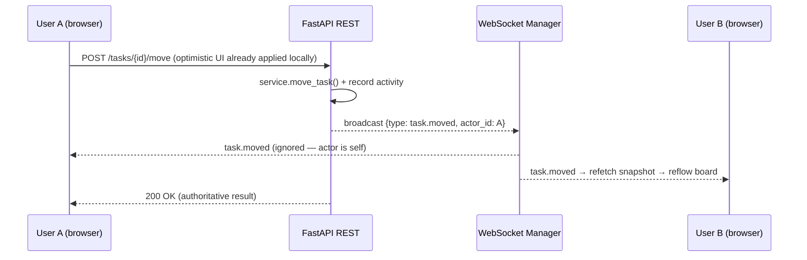

# TaskFlow — Architecture

This document covers the layered design, data model, real-time mechanics, and the
scaling path. For setup and feature docs see the root [README](../README.md).

## Goals

- **Clean separation of concerns** so the codebase reads well and scales.
- **Optimistic, real-time UX** — the board feels instant locally and stays in sync
  across collaborators.
- **One DB-agnostic codebase** — SQLite for zero-setup local dev, PostgreSQL in
  Docker/production, identical models and queries.

## Backend layers

```
┌──────────────────────────────────────────────────────────────┐
│  API routes  (app/api/routes)                                  │
│  - HTTP shape, status codes, validation via Pydantic schemas   │
│  - Permission guards (BoardAccess dependency: viewer/editor/owner) │
├──────────────────────────────────────────────────────────────┤
│  Services  (app/services)                                      │
│  - Business logic: position math, role rules, password reset   │
│  - realtime.record_and_broadcast(): activity + WS fan-out      │
├──────────────────────────────────────────────────────────────┤
│  Repositories  (app/repositories)                              │
│  - All SQLAlchemy queries live here; one module per aggregate  │
├──────────────────────────────────────────────────────────────┤
│  Models / DB  (app/models, app/db)                             │
│  - SQLAlchemy 2.0 async models + declarative base              │
└──────────────────────────────────────────────────────────────┘
```

Routes never touch the ORM directly; they call services, which call repositories.
This keeps SQL in one place and business rules testable in isolation.

## Data model

```mermaid
erDiagram
    USER ||--o{ BOARD : owns
    USER ||--o{ BOARD_MEMBER : "is"
    BOARD ||--o{ BOARD_MEMBER : has
    BOARD ||--o{ COLUMN : has
    BOARD ||--o{ LABEL : has
    BOARD ||--o{ ACTIVITY_LOG : records
    COLUMN ||--o{ TASK : contains
    TASK }o--o{ LABEL : "tagged via TASK_LABEL"
    TASK ||--o{ CHECKLIST_ITEM : "has"
    TASK ||--o{ COMMENT : "has"
    USER ||--o{ COMMENT : authors

    USER { int id PK; string email UK; string password_hash; string name; string avatar_url }
    BOARD { int id PK; int owner_id FK; string name; string description; string color }
    BOARD_MEMBER { int id PK; int board_id FK; int user_id FK; enum role }
    COLUMN { int id PK; int board_id FK; string name; int position }
    TASK { int id PK; int column_id FK; string title; text description; datetime due_date; enum priority; int position }
    LABEL { int id PK; int board_id FK; string name; string color }
    CHECKLIST_ITEM { int id PK; int task_id FK; string content; bool is_done; int position }
    COMMENT { int id PK; int task_id FK; int user_id FK; text content; datetime created_at }
    ACTIVITY_LOG { int id PK; int board_id FK; int user_id FK; string action_type; json payload }
```

`CHECKLIST_ITEM` and `COMMENT` are children of a task (`ON DELETE CASCADE`, so deleting
a task removes both). Checklist items use the same gapped-`position` ordering as tasks/
columns. The board snapshot carries each task's `checklist_done`/`checklist_total` so the
card can show progress without fetching every item; full item lists and comment threads
load on demand when a task dialog opens. **Filtering and sorting are client-only** view
state (Zustand, `board-view-store`) layered over the snapshot via the pure
`lib/task-filter-sort.ts` helper — they never hit the server and never affect other
members. Due-status badges are computed client-side from `due_date` vs the viewer's local
day (`lib/due-status.ts`).

### Ordering & drag-drop positions

Columns and tasks use **gapped integer `position`** values (step = 1000). On a move,
the affected column's items are renumbered from the desired order:

- **O(n)** in the column size (kanban columns are small) and always consistent —
  no fragile fractional-gap arithmetic that can run out of precision.
- Moving across columns renumbers both the source (to compact) and the destination.

The same logic exists on the client (`lib/board-logic.ts`, unit-tested) so the UI can
reorder optimistically before the server confirms. The server is authoritative: on a
move-event from another user, the client refetches the snapshot to reconcile exactly.

### Permissions

`BoardMember.role` is one of `owner | editor | viewer`. A dependency factory
`BoardAccess(min_role)` resolves the caller's role for the `board_id` path param and
rejects insufficient access. Non-members get `404` (existence is not leaked), under-
privileged members get `403`.

## Authentication

- Password hashing: **bcrypt** (72-byte safe).
- JWT (HS256) via **python-jose**, stored in an **httpOnly cookie** — not readable by
  JS, mitigating XSS token theft. The API also accepts a `Bearer` header as a fallback
  (useful for tooling/tests).
- WebSocket handshakes can't set headers in the browser, so the socket reads the cookie
  or a `?token=` query param.
- Password reset issues a short-lived `password_reset`-typed token; delivery is logged
  with a TODO for a real email provider.

## Real-time



The **ConnectionManager** keeps `board_id → {conn_id → WebSocket}` plus a **presence**
registry (`board_id → {conn_id → user}`, de-duplicated by user id for multi-tab). On
connect/disconnect it broadcasts the current viewer list; dead sockets are pruned on
send failure.

**Domain events** broadcast on the board channel (all carry `actor_id`; clients ignore
their own echo): `task.created|updated|deleted|moved`, `column.created|updated|deleted|
reordered`, `label.created|deleted`, `checklist.created|updated|reordered|deleted`, and
`comment.created|deleted`. Most mutations also write an `ActivityLog` row via
`realtime.record_and_broadcast()`. High-frequency, low-signal checklist changes (toggle,
reorder) use `realtime.broadcast_only()` instead — they sync live but are intentionally
**not** logged to the activity feed (only add/remove are), keeping the feed readable.

## Frontend UX layer (loading, motion, empty states)

Presentation polish is intentionally **CSS-first and dependency-free** (no animation
library). The pieces:

- **Skeletons** — a `Skeleton` primitive (`components/ui/skeleton.tsx`, `.skeleton`
  shimmer in `globals.css`) composes into content-shaped placeholders
  (`components/skeletons/*`) sized to match real content, so swapping in data causes no
  layout shift. They replace spinners on the boards list, board snapshot, and the task
  dialog's checklist/comments.
- **Enter/exit animations** — `fade-in`/`scale-in` (enter) and `fade-out`/`scale-out`
  (exit) keyframes (tailwind.config) plus a small `useExitTransition(open, ms)` hook
  that keeps an element mounted through its close animation and is interruption-safe.
  Used by the dialog and the mobile-nav drawer (the activity drawer already
  transform-animates both ways). List reveals use a pure `lib/stagger.ts` delay helper.
- **Buttons** — a single `loading` prop on `components/ui/button.tsx` renders the
  in-button spinner and disables the button, replacing the previously hand-rolled
  per-call-site pattern.
- **Reduced motion / transparency** — the global `globals.css` media blocks neutralize
  all of the above automatically; the settled desktop (≥1280px) view is unchanged.

## Scaling path: in-memory → Redis Pub/Sub

v1 broadcasting is **in-process**, which is correct for a single backend instance. To
run multiple instances behind a load balancer, each instance only holds a subset of the
sockets, so a local broadcast won't reach everyone. The planned change (TODO in
`app/websockets/manager.py`):

1. On a mutation, **publish** the event to a Redis channel `board:{id}` instead of (or
   in addition to) broadcasting locally.
2. Every instance **subscribes** to `board:*` and relays received events to its own
   local sockets.
3. Presence moves to a Redis hash with TTL heartbeats so it's shared across instances.

`REDIS_URL` and a `redis` service are already wired in config and `docker-compose.yml`,
so this is a code change, not an infrastructure change.

## Testing strategy

- **Backend:** pytest with an **in-memory SQLite** DB on a `StaticPool` (one shared
  connection), fresh schema per test, and the `get_db` dependency overridden. Covers
  auth flows, CRUD, permission checks (multi-user), drag-drop ordering, and WebSocket
  connect/presence/rejection. ~79% coverage.
- **Frontend:** Vitest unit tests for utilities and the pure drag-drop ordering helper
  (`moveTaskInColumns`), which is the trickiest piece of client logic.
